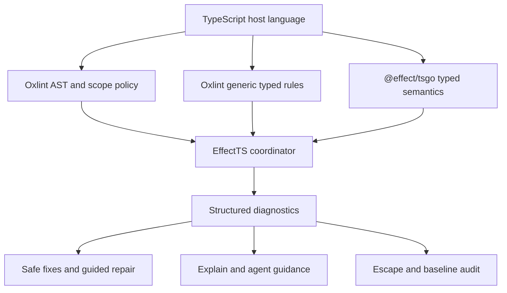
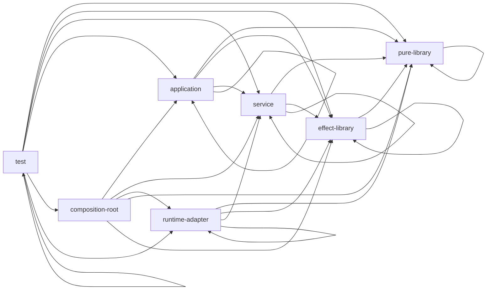
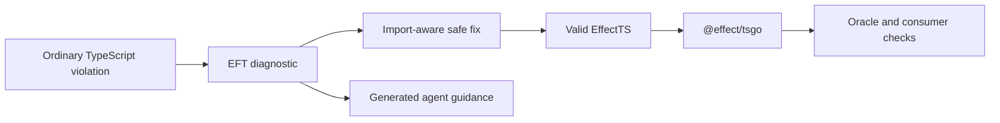

# Design spec 0002: EffectTS enforcement layer

Status: accepted; Stage 2 implemented

Configuration amendment: design spec 0003 supersedes sections 5.1 and 5.2.
EffectTS remains the product's semantic model, but it is no longer a selectable
profile. The plugin domain is implicit, strictness selects the rule collection,
and role, platform, and boundary remain applicability context.

Date: 2026-08-11

Summary: This design evolves the package into an EffectTS enforcement layer. It does not authorize Stage 2 implementation.

Rule and gap details: [`0002-effectts-rule-gap-matrix.md`](./0002-effectts-rule-gap-matrix.md)

## 1. Decision scope

This specification defines the next product model and its smallest tracer. It preserves the accepted package and compatibility contracts from design spec 0001.

The repository and package names stay unchanged:

- repository: `oxlint-effect-plugin`
- package: `@phibkro/oxlint-effect-plugin`
- default rule namespace: `effect/*`
- current technology target: `effect-v4`
- exact reviewed Effect release: `4.0.0-beta.107`

The product description changes from “an Effect lint plugin” to:

> An enforcement, diagnostics, repair, and guidance layer for the EffectTS language profile.

EffectTS remains ordinary TypeScript source. The project does not add a parser, compiler, syntax, or transformed source language.

## 2. Current baseline

The accepted tracer already provides a sound base for the new profile.

| Current fact                                              | Canonical evidence                                          |
| --------------------------------------------------------- | ----------------------------------------------------------- |
| Eight default rules and one opt-in rule ship in ESM.      | `src/index.ts`, `src/rules/`, `package.json`                |
| Technology, role, platform, and boundary are orthogonal.  | `src/domains.ts`, `src/config/expand.ts`                    |
| Rule metadata drives generated rule docs and preset docs. | `src/registry.ts`, `scripts/generate.ts`                    |
| Custom rules do not receive TypeScript type information.  | `src/plugin-api.ts`, `docs/tsgo-boundary.md`                |
| Typed Effect diagnostics belong to `@effect/tsgo`.        | `docs/tsgo-boundary.md`, `compatibility.json`               |
| Native disable comments need an independent host audit.   | `src/suppression-audit.ts`, `docs/suppression-audit.md`     |
| `dist/` is ignored derived output.                        | `scripts/prepare-package.ts`, `scripts/verify-dist.ts`      |
| Consumer checks use the packed compiled artifact.         | `scripts/accept-0001.ts`, `scripts/consumer/run-matrix.mjs` |

The portable core remains free of filesystem and runtime authority. New CLI or project-graph work must stay behind explicit adapters.

## 3. Product boundary and guarantee



The coordinator normalizes separate evidence sources. It does not pretend that one source proved another.

The product has six modules:

1. **Profile knowledge** defines accepted semantics and rule metadata.
2. **Oxlint enforcement** checks syntax, scope, and conservative import facts.
3. **Typed companions** check generic TypeScript and Effect-specific typed facts.
4. **Diagnostics and repair** explain and correct supported violations.
5. **Audit and migration** track escapes and legacy debt.
6. **Guidance assets** teach humans and coding agents before validation.

The product can make this bounded claim:

> A file with no enabled EffectTS diagnostics conforms to the configured syntactic, scope, module-policy, and typed Effect subset, except for recorded escapes.

This claim requires all profile rules to run at `error`. It also requires the pinned typed checks and relevant host gates.

A warning is guidance. It does not establish profile conformance.

The product does not claim formal proof, complete type safety, or complete architectural inference.

## 4. EffectTS language profile

### 4.1 Nested profile model

```text
JavaScript
  -> TypeScript host profile
    -> EffectTS semantic profile
      -> configured project dialect
```

TypeScript owns parsing, runtime syntax, emit semantics, and the type system. EffectTS restricts admitted application semantics.

```text
EffectTS
  = restricted pure TypeScript
  + TypeScript types
  + Effect v4 abstractions
  - native application effects
  - native asynchronous control flow
  - native application failure
  - ambient authority
  - unmanaged application state and resources
  - unrestricted capability-bearing imports
```

The project dialect adds role policy, explicit rule overrides, and recorded escapes.

### 4.2 Admitted semantic vocabulary

| Responsibility              | Admitted vocabulary                                                                          | Exact beta.107 evidence                                                                                                                             |
| --------------------------- | -------------------------------------------------------------------------------------------- | --------------------------------------------------------------------------------------------------------------------------------------------------- |
| Domain model                | `Schema`, schema classes                                                                     | `node_modules/effect/src/Schema.ts`                                                                                                                 |
| Domain branching            | `Match` when typed pattern exhaustiveness improves domain code                               | `node_modules/effect/src/Match.ts`                                                                                                                  |
| Domain error                | `Schema.TaggedErrorClass` and the typed error channel                                        | `node_modules/effect/src/Schema.ts`                                                                                                                 |
| External decoding           | `Schema.decodeUnknownEffect` and named decoders                                              | `node_modules/effect/src/Schema.ts`                                                                                                                 |
| Representation change       | `Schema.decodeTo` and `SchemaTransformation`                                                 | `node_modules/effect/src/Schema.ts`, `SchemaTransformation.ts`                                                                                      |
| Effectful computation       | `Effect<A, E, R>`                                                                            | `node_modules/effect/src/Effect.ts`                                                                                                                 |
| Reusable effectful function | `Effect.fn` and Effect combinators                                                           | `node_modules/effect/src/Effect.ts`                                                                                                                 |
| Dependency                  | `Context.Service` and `Context.Reference`                                                    | `node_modules/effect/src/Context.ts`                                                                                                                |
| Implementation              | `Layer`                                                                                      | `node_modules/effect/src/Layer.ts`                                                                                                                  |
| Managed state               | `Ref`, `SynchronizedRef`, `SubscriptionRef`, and `Tx*` modules where transactions are needed | `node_modules/effect/src/Ref.ts`, `SynchronizedRef.ts`, `SubscriptionRef.ts`, `TxRef.ts`                                                            |
| Resource lifetime           | `Scope`, `Effect.acquireRelease`, scoped Effects and Layers                                  | `node_modules/effect/src/Scope.ts`, `Effect.ts`, `Layer.ts`                                                                                         |
| Concurrency                 | Fibers, `Effect.all`, race APIs, `Deferred`, `Queue`, `Semaphore`, `PubSub`                  | `node_modules/effect/src/Fiber.ts`, `Effect.ts`, `Deferred.ts`, `Queue.ts`, `Semaphore.ts`, `PubSub.ts`                                             |
| Streaming                   | `Stream` for pull, back-pressure, or incremental processing                                  | `node_modules/effect/src/Stream.ts`                                                                                                                 |
| Observability               | Effect logging, `Console`, logger and tracing services                                       | `node_modules/effect/src/Effect.ts`, `Console.ts`, `Logger.ts`                                                                                      |
| Configuration               | `Config` plus explicit provider Layers                                                       | `node_modules/effect/src/Config.ts`, `ConfigProvider.ts`                                                                                            |
| Time and randomness         | `Clock`, `Random`, or a project service                                                      | `node_modules/effect/src/Clock.ts`, `Random.ts`                                                                                                     |
| Platform authority          | Effect platform services or project services                                                 | `node_modules/@effect/platform-node/src/NodeServices.ts`, `NodeRuntime.ts`; `node_modules/@effect/platform-bun/src/BunServices.ts`, `BunRuntime.ts` |
| Program execution           | A designated `composition-root`                                                              | existing execution policy                                                                                                                           |
| External JavaScript interop | A `runtime-adapter` or narrow reasoned escape                                                | profile policy                                                                                                                                      |

`Schema.Type` and `Schema.Encoded` are distinct. Decoding and encoding are separate boundaries.

The pinned public service module is `Context`, not `ServiceMap`. `Config<T>` is an Effect-backed decoder, and its default provider can read ambient environment.

The live `../effect` checkout is `effect@4.0.0-beta.107` at commit `2e1ddbebd9dd5cf0738ea08b2e832a7c39ae990f`. Its guides corroborate the installed pinned source used for exact API claims.

### 4.3 Restricted pure TypeScript kernel

The profile admits plain TypeScript for small, total, deterministic computation.

| Admitted                                                    | Rejected or redirected                                                    |
| ----------------------------------------------------------- | ------------------------------------------------------------------------- |
| Arithmetic, boolean logic, templates, and property access   | Ambient time, random, environment, network, filesystem, or process access |
| Total functions over supplied values                        | `async`, `await`, native Promise control flow                             |
| Immutable value construction                                | Throw-based expected application failure                                  |
| Local loops, recursion, and low-level `switch` control flow | Module-level mutable application state                                    |
| Encapsulated local mutation that cannot escape              | Resource acquisition without a managed lifetime                           |
| Type aliases and utility types                              | Raw decoding at an external boundary                                      |
| Data projection after Schema decoding                       | Capability-bearing SDK imports in application code                        |
| Callbacks that only forward typed data                      | Hidden execution of an Effect runtime                                     |

These expressions remain valid:

```ts
const next = count + 1;
const fullName = `${user.firstName} ${user.lastName}`;
const visible = enabled && user.active;
```

Schema does not own every expression. It owns domain meaning, external representations, validation, and named transformations.

The profile cannot infer a domain model from a type name. A general `require-schema-domain-model` rule is currently unenforceable without an explicit marker.

## 5. Configuration architecture

### 5.1 Superseded decision: `effectts` as a selectable profile

`effectts` is not a technology domain, strictness value, or severity.

| Axis       | Question                                         | Example                          |
| ---------- | ------------------------------------------------ | -------------------------------- |
| Technology | Which reviewed semantic ecosystem supplies APIs? | `effect-v4`                      |
| Profile    | Which programming model does the project adopt?  | `effectts`                       |
| Preset     | Which stable rule collection is active?          | `recommended`, `strict`          |
| Role       | What responsibility does this file group own?    | `application`, `runtime-adapter` |
| Platform   | Which runtime authority is admitted?             | `portable`, `node`               |
| Boundary   | Which semantic crossing occurs here?             | `external-data`                  |
| Severity   | Does a diagnostic fail, warn, or stay off?       | `error`, `warn`, `off`           |

Biome domains informed the technology axis. They group rules for an ecosystem.

EffectTS is stronger. It declares a programming model inside TypeScript. Therefore, `profile` is the clearest independent axis.

Dependency discovery can suggest `technology: "effect-v4"`. Discovery must never enable or weaken `profile: "effectts"`.

### 5.2 Superseded interface

```ts
expandDomains({
  technology: "effect-v4",
  profile: "effectts",
  preset: "recommended",
  trustedPureDependencies: [
    {
      specifier: "date-fns",
      reason: "Only total transforms over caller-supplied Date values are imported",
    },
  ],
  rules: {
    "no-untyped-throw": "warn",
  },
  groups: [
    {
      files: ["src/application/**"],
      role: "application",
      platform: "portable",
      boundaries: ["external-data"],
    },
    {
      files: ["src/adapters/payments/**"],
      role: "runtime-adapter",
      platform: "node",
      adapterDependencies: ["stripe"],
    },
    { files: ["src/main.ts"], role: "composition-root", platform: "node" },
  ],
});
```

This interface ships from the package root.

Stage 2 renames group `strictness` to `preset`. Every caller migrated without an alias.

`profile: "effectts"` activates every rule with `profile.required === true` at `error`. Presets can add optional rules. They cannot remove required profile rules.

`no-native-promise-control-flow` and `no-untyped-throw` become required profile rules. Their current `strictOnly` gate does not apply when the EffectTS profile is active.

All eight default EffectTS rules are required when their declared role and boundary applicability matches. `no-import-from-barrel-package` remains off until the project selects package roots and enables its severity.

Precedence is explicit:

1. A project-wide rule override has highest authority and changes the project dialect.
2. A group rule override applies inside that group.
3. Required profile rules supply the default EffectTS floor.
4. A group preset adds optional rules before the project preset.
5. The project preset adds its optional rules.
6. Registry defaults supply severity and options.

`expandDomains` resolves this precedence before emission. It emits resolved group severities into `overrides` and leaves root `rules` empty.

A consumer who hand-writes top-level Oxlint rules gets Oxlint's native group-wins order instead of this resolved precedence.

The coordinator must reject conflicting role or platform assignments after it resolves file groups. A file cannot have two architectural identities.

An enabled profile rule defaults to `error`. A project can use `warn` for migration, but the file is not conforming.

## 6. Architectural roles

The existing seven roles remain sufficient.

| Role               | Responsibility                                      | Key restrictions                                         |
| ------------------ | --------------------------------------------------- | -------------------------------------------------------- |
| `pure-library`     | Total deterministic values and algorithms           | No Effect execution or ambient capability                |
| `effect-library`   | Reusable Effects, schemas, services, and Layers     | Requirements remain open and no runtime executes         |
| `service`          | Service contracts and Effect-native implementations | Raw vendor and platform authority stay behind adapters   |
| `application`      | Portable orchestration                              | No final provision or execution                          |
| `composition-root` | Select live Layers and run the program              | Runtime execution is local and explicit                  |
| `runtime-adapter`  | Bind one external platform or vendor capability     | Interop stays local and returns Effect-native interfaces |
| `test`             | Controlled execution and replacement services       | Test authority does not leak into production modules     |

The Effect repository can combine a service and live vendor implementation. EffectTS chooses a stricter project architecture.

A `service` can depend on Effect services and project services. A `runtime-adapter` owns raw SDK or platform binding.

Roles answer what a module owns. Escapes answer why one violation is accepted.

## 7. Escape policy

EffectTS is default-closed for governed files. There is one EffectTS world with explicit holes.

### 7.1 Local exception

```ts
// oxlint-effect-plugin allow(no-native-promise-control-flow):
// reason: vendor Promise API is lifted immediately into PaymentClient here
vendor.load();
```

Rules:

- The directive target names exactly one rule. Wildcard or multi-rule targets are broad and fail.
- The next comment contains a nonempty `reason:` value.
- It applies to the next syntax node in the same lexical block.
- It suppresses every diagnostic for the named rule inside that node.
- Zero matches are unused or stale. Duplicate, missing-reason, or misplaced directives also fail.
- Native disable directives are forbidden. Oxlint removes them before rules run, so `auditNativeDisableDirectives` enforces this rule as an independent host gate.
- A profile run without the native-disable host gate cannot claim conformance.

The two-line form is canonical. `oxlint-effect-plugin` is the fixed package marker and never follows a configured plugin alias.

The console-only `dev only:` protocol will make a clean cutover to this general protocol.

#### Contract amendments

Stage 2 amends the AGENTS.md `dev only:` invariant and design spec 0001 acceptance item 10. The replacement requires an exact rule and a nonempty `reason:`. No other 0001 criterion changes.

Stage 2 must update the README, generated console rule documentation, registry, generator, suppression parser, audits, unit tests, and five existing suppression fixtures. The accepted 84/84 record remains historical evidence.

### 7.2 File opt-out

```ts
// oxlint-effect-plugin ignore-file:
// reason: generated vendor bindings wrapped by PaymentClient
```

Rules:

- It appears after an optional shebang and before imports or executable code.
- The next comment contains a nonempty `reason:` value.
- The file leaves EffectTS enforcement entirely.
- The audit always reports the file and reason.
- Native linter disable comments remain forbidden.

A file opt-out declares ordinary TypeScript by design. It is intentionally more visible than a local exception.

A file opt-out is never auto-classified as stale. The audit cannot prove that ordinary TypeScript should re-enter the profile. An operator must remove the opt-out and run enforcement.

### 7.3 Project override and audit

A committed `rules: { "rule-name": "off" }` changes the project dialect. The tool must not infer this change.

`effectts suppressions` will report five separate inventories:

- local intentional exceptions
- file-level opt-outs
- project-wide disabled profile rules
- migration baseline entries
- native disable directives rejected by the host audit

Intentional exceptions and migration debt never share one count or one storage model.

## 8. Migration suppression debt

A baseline records existing violations. It does not approve their semantics.

Proposed file: `effectts-baseline.json`.

Each deterministic entry contains a schema version, compatibility identity, path, rule, code, syntax-anchor fingerprint, and duplicate ordinal.

The baseline contains no timestamp. Identical input must produce identical bytes.

```text
legacy TypeScript
  -> generate baseline
  -> reject new violations
  -> remove legacy violations
  -> reject stale entries
  -> strict EffectTS
```

Requirements:

- A new unmatched diagnostic fails.
- A changed diagnostic does not silently consume an old entry.
- A stale entry fails and is pruned explicitly.
- Re-baselining is an explicit repository change.
- Baseline generation applies safe fixes first.
- Baseline entries never act as architectural reasons.

ESLint bulk suppressions supply the adoption model. EffectTS uses stronger diagnostic identity than per-file counts.

## 9. Import closure

Import closure is a module-policy gate. A single-file lint rule cannot prove the project graph.

| Import edge                               | Default decision                                  | Evidence                               |
| ----------------------------------------- | ------------------------------------------------- | -------------------------------------- |
| EffectTS -> core `effect` package         | allow                                             | technology identity                    |
| EffectTS -> Effect platform package       | allow only when role and platform policy admit it | role, platform, and package classifier |
| EffectTS -> governed EffectTS module      | allow when the role graph permits it              | module graph and groups                |
| EffectTS -> trusted pure package          | allow                                             | explicit human assertion               |
| EffectTS -> raw vendor SDK                | reject                                            | package policy                         |
| `runtime-adapter` -> declared vendor SDK  | allow                                             | role plus `adapterDependencies`        |
| `composition-root` -> live platform Layer | allow                                             | role plus platform                     |
| Side-effect-only package import           | reject outside an adapter or root allowance       | syntax and package policy              |
| Type-only import                          | allow unless a narrower project rule rejects it   | TypeScript emit semantics              |

Minimum dependency direction:



A runtime adapter must not import an application or root. Application code must not import a concrete adapter.

Same-role imports are admitted for pure, Effect, service, application, adapter, and test modules. Composition roots do not import other roots.

A trusted pure entry has an exact package or subpath and a nonempty reason. Trust is a human assertion, not static proof.

Undeclared value imports are unknown, not automatically unsafe. Governed application roles reject the unknown edge.

The coordinator owns project resolution and graph construction. Oxlint rules keep per-file static specifier checks.

## 10. Semantic families

| Family          | Responsibility                                             |
| --------------- | ---------------------------------------------------------- |
| `modeling`      | Domain meaning and Schema ownership                        |
| `failure`       | Typed expected failure and defects                         |
| `computation`   | Effectful computation instead of native async control flow |
| `capability`    | Explicit authority and dependency requirements             |
| `state`         | Effect-managed mutable application state                   |
| `lifecycle`     | Scope, acquisition, release, and cancellation              |
| `concurrency`   | Structured concurrency and coordination                    |
| `execution`     | Runtime execution and final provision topology             |
| `boundary`      | External decoding, encoding, and interop                   |
| `architecture`  | Roles, Layers, services, and import closure                |
| `platform`      | Portable and runtime-specific authority                    |
| `observability` | Logging, tracing, metrics, and redaction                   |

One rule can observe several AST forms. `async`, `await`, and `Promise.all` remain one computation invariant.

### 10.1 Switch statements and `Match`

Verdict: a rule is viable, but only as an optional project-dialect rule. It is not part of the required EffectTS floor.

Pinned beta.102 `Match` supports ordered patterns, tagged unions, fallbacks, and typed exhaustiveness. The AST exposes every `SwitchStatement`, so a syntax diagnostic is reliable.

The proposed rule is `prefer-match-over-switch` in the `modeling` family. When enabled at `error`, it disallows switch statements in its configured domain-facing groups.

It should not apply by default to `pure-library`, `runtime-adapter`, `composition-root`, or `test` roles. Switch is valid pure TypeScript control flow, and the pinned Effect implementation uses it in low-level kernels.

If the goal is exhaustiveness alone, use Oxlint's typed `typescript/switch-exhaustiveness-check`. The custom rule expresses an Effect idiom, not stronger type proof.

Example guidance:

```ts
return Match.value(status).pipe(
  Match.when("idle", () => 0),
  Match.when("ready", () => 1),
  Match.exhaustive,
);
```

General automatic conversion is not viable. A switch can contain fallthrough, labels, declarations, side-effectful case tests, or control flow that a matcher callback changes.

`Match.exhaustive` also needs typed union evidence. A JavaScript plugin cannot prove it. `Match.value` can add allocation and callback overhead to a low-level branch.

Stage 3 should test one narrow suggestion shape: an unlabeled switch with primitive literal cases, a final default, and one direct return expression per case. Its suggested form uses `Match.orElse`, not `Match.exhaustive`.

The first version has no automatic fix. It emits `choice-required` guidance for simple return switches and `refactor-required` guidance for all other forms.

## 11. Analysis and proof boundaries

```ts
type EnforcementProofSource = "syntax" | "scope" | "module-graph" | "typed-oxlint" | "tsgo";

type KnowledgeStatus = "convention" | "unenforceable";

type ProofSource = EnforcementProofSource | KnowledgeStatus;
```

Only `EnforcementProofSource` values can produce enforcement diagnostics.

| Layer               | Authority                                                              | Exclusions                                             |
| ------------------- | ---------------------------------------------------------------------- | ------------------------------------------------------ |
| Oxc AST and scope   | Syntax, local bindings, static imports, role policy                    | Arbitrary aliases, wrappers, types, dynamic provenance |
| Module-graph gate   | Resolved imports and configured file groups                            | Package purity and runtime behavior                    |
| Oxlint typed engine | Generic TypeScript typed diagnostics                                   | Effect-specific semantics and custom plugin types      |
| `@effect/tsgo`      | Effect types, requirements, errors, strict provision, floating Effects | Project roles and import policy                        |
| Convention          | Guidance no current engine can prove                                   | Acceptance guarantee                                   |

Pinned `@effect/tsgo@0.36.4` owns typed Effect facts. These include floating Effects, missing context or errors, strict provision, unsafe assertions, and lazy Promise values inside `Effect.sync`.

Required EffectTS TSGO severities:

| Diagnostic                  | Required severity |
| --------------------------- | ----------------- |
| `floatingEffect`            | `error`           |
| `missingEffectContext`      | `error`           |
| `missingEffectError`        | `error`           |
| `missingLayerContext`       | `error`           |
| `strictEffectProvide`       | `error`           |
| `unsafeEffectTypeAssertion` | `error`           |
| `lazyPromiseInEffectSync`   | `error`           |

These are the “pinned typed checks” required by the conformance claim. Stock TSGO defaults are not sufficient.

The coordinator invokes TSGO through its supported CLI or LSP surface. It does not import private metadata or TypeScript-Go host interfaces.

Syntax diagnostics owned here stay disabled in TSGO. These include async functions, new Promise, global console, global authority, and raw JSON diagnostics.

Arbitrary typed `.then`, `.catch`, and `.finally` chains remain unenforceable. The plugin must not guess from member names.

## 12. Shared rule knowledge

`src/registry.ts` will evolve into the canonical executable knowledge base.

```ts
interface EffectTSRuleDefinition {
  readonly rule: RuleName;
  readonly code: EffectTSCode;
  readonly family: RuleFamily;
  readonly invariant: string;
  readonly summary: string;
  readonly rationale: string;
  readonly proofSources: readonly ProofSource[];
  readonly defaultSeverity: "error" | "warn";
  readonly defaultOptions: Readonly<Record<string, unknown>>;
  readonly presets: readonly Preset[];
  readonly profile: {
    readonly required: boolean;
    readonly roles: readonly Role[];
    /** Any listed boundary activates the rule. An empty list is boundary-independent. */
    readonly boundaries: readonly Boundary[];
  };
  readonly diagnostic: {
    readonly message: string;
    readonly explanation: string;
    readonly help: string;
    readonly docs: string;
  };
  readonly replacements: readonly Replacement[];
  readonly suppression: "none" | "local-reasoned";
  readonly tsgo: {
    readonly overlap: readonly string[];
    readonly authority: string;
  };
  readonly limitations: readonly string[];
}
```

The registry remains portable and pure. Filesystem generation stays in `scripts/` or a CLI adapter.

Generated projections include rule docs, diagnostic help, explain data, knowledge JSON, presets, and normative agent guidance.

Rich examples can stay hand-written. A generation check validates their invariant IDs and rule references.

## 13. Structured diagnostics

### 13.1 Canonical object

```ts
type Digit = "0" | "1" | "2" | "3" | "4" | "5" | "6" | "7" | "8" | "9";
type EffectTSCode = `EFT${"1" | "2" | "3" | "4" | "5" | "9"}${Digit}${Digit}${Digit}`;

interface Span {
  readonly file: string;
  readonly offset: number;
  readonly length: number;
  readonly line: number;
  readonly column: number;
}

interface TextEdit {
  readonly range: { readonly start: number; readonly end: number };
  readonly text: string;
}

interface Replacement {
  readonly from: string;
  readonly to: string;
  readonly applicability: SuggestionApplicability;
  readonly import?: { readonly module: string; readonly symbol: string };
}

type EffectTSSuggestion =
  | {
      readonly message: string;
      readonly applicability: "machine-applicable";
      readonly edits: readonly TextEdit[];
    }
  | {
      readonly message: string;
      readonly applicability: Exclude<SuggestionApplicability, "machine-applicable">;
      readonly edits?: never;
    };

type AuditInvariant =
  | "invalid-local-exception"
  | "stale-local-exception"
  | "invalid-file-opt-out"
  | "new-baseline-violation"
  | "stale-baseline-entry"
  | "broad-native-disable"
  | "plugin-native-disable";

type DiagnosticSubject =
  | { readonly kind: "rule"; readonly rule: `${string}/${RuleName}`; readonly ruleName: RuleName }
  | { readonly kind: "companion"; readonly name: string }
  | { readonly kind: "module-graph"; readonly invariant: "import-closure" }
  | { readonly kind: "audit"; readonly invariant: AuditInvariant };

interface EffectTSDiagnostic {
  readonly schemaVersion: 1;
  readonly code: EffectTSCode;
  readonly subject: DiagnosticSubject;
  readonly family: RuleFamily | "audit";
  readonly invariant: string;
  readonly severity: "error" | "warning";
  readonly message: string;
  readonly primarySpan: Span;
  readonly explanation?: string;
  readonly help?: string;
  readonly docs: string;
  readonly proofSources: readonly EnforcementProofSource[];
  readonly suggestions: readonly EffectTSSuggestion[];
  readonly origin: {
    readonly engine: "oxlint" | "typed-oxlint" | "tsgo" | "module-graph" | "audit";
    readonly code: string;
  };
}
```

Span offsets and lengths are zero-based bytes. Human line and column values are one-based.

The coordinator reuses Oxlint JSON for severity, path, labels, and native rule code. For rule subjects, it strips the configured plugin alias and joins registry data on bare `ruleName`.

The registry does not copy source locations or runtime severity. This avoids a second truth beside Oxlint output.

TSGO diagnostics keep their original names and spans. The coordinator maps them only through declared companion metadata.

### 13.2 Human presentation

Each diagnostic contains:

1. what failed
2. why EffectTS rejects it
3. which Effect concept owns it
4. how to correct it
5. whether a correction is automatic
6. where to read more
7. which source supports the claim

```text
error[EFT2101]: ambient console access is outside EffectTS

  --> src/users/load.ts:18:3

18 |   console.log(user)
   |   ^^^^^^^^^^^ ambient observability bypasses the Effect environment

help: use Effect logging or Console inside the Effect computation

note: this finding comes from syntax and resolved scope, not TypeScript types
```

### 13.3 Stable codes

Codes identify semantic invariants. Rule names remain configuration and suppression identifiers.

| Range     | Family                                                  |
| --------- | ------------------------------------------------------- |
| `EFT1xxx` | modeling and boundary                                   |
| `EFT2xxx` | observability, capability, and platform                 |
| `EFT3xxx` | computation, failure, state, lifecycle, and concurrency |
| `EFT4xxx` | execution                                               |
| `EFT5xxx` | architecture and import closure                         |
| `EFT9xxx` | profile, escape, baseline, and configuration audit      |

Initial allocations:

| Code      | Rule or audit invariant                               |
| --------- | ----------------------------------------------------- |
| `EFT1101` | `no-opaque-instance-fields`                            |
| `EFT1201` | `no-raw-json-parse`                                   |
| `EFT1301` | optional Stage 3 `prefer-match-over-switch` candidate |
| `EFT2101` | `no-ambient-console`                                  |
| `EFT2201` | `no-ambient-authority`                                |
| `EFT2301` | `no-cross-runtime`                                    |
| `EFT3101` | `no-native-promise-control-flow`                      |
| `EFT3201` | `no-untyped-throw`                                    |
| `EFT4101` | `no-premature-execution`                              |
| `EFT5101` | module-graph import-closure gate                      |
| `EFT5102` | opt-in `no-import-from-barrel-package`                 |
| `EFT9001` | invalid local exception                               |
| `EFT9002` | unused or stale local exception                       |
| `EFT9011` | invalid file opt-out                                  |
| `EFT9021` | new violation outside migration baseline              |
| `EFT9022` | stale migration baseline entry                        |
| `EFT9031` | broad native disable                                  |
| `EFT9032` | native disable targeting a configured plugin alias    |

A released code is never reassigned. A removed invariant leaves a tombstone in compatibility metadata.

## 14. Repair model

```ts
type SuggestionApplicability =
  "machine-applicable" | "choice-required" | "refactor-required" | "boundary-required";
```

| Applicability        | Meaning                                                    | Tool action                 |
| -------------------- | ---------------------------------------------------------- | --------------------------- |
| `machine-applicable` | The edit is local, complete, and preserves the contract.   | Apply in safe fix mode.     |
| `choice-required`    | Several valid Effect designs exist.                        | Show editor choices.        |
| `refactor-required`  | Function types, requirements, errors, or ownership change. | Explain the redesign.       |
| `boundary-required`  | Interop must move to or stay inside an adapter.            | Explain the boundary shape. |

No suggestion object means that no supported repair exists.

This vocabulary adapts Rust applicability to Effect architecture. It does not claim Rust compiler equivalence.

Oxlint fixes and suggestions have no applicability field. The coordinator carries this taxonomy. Only `machine-applicable` suggestions enter Oxlint's automatic fix channel.

### 14.1 Console repair correction

This edit is not safe in general:

```diff
- console.log(value)
+ Console.log(value)
```

Pinned beta.102 `Console.log` returns `Effect.Effect<void>`. A bare replacement creates a floating Effect and does not run the log.

The automatic tracer case is narrower:

```diff
+ import { Console } from "effect"

  Effect.gen(function*() {
-   console.log(value)
+   yield* Console.log(value)
  })
```

The fix is automatic only when all conditions hold:

- `console` resolves to the ambient global.
- The call is a standalone expression in a recognized Effect generator.
- Adding `yield*` does not cross another function or callback.
- The import planner finds a collision-free value binding.

Parse, relint, TSGO, format, and idempotence are CI oracle post-conditions from section 15. They are never fixer-time preconditions.

Other console sites receive refactor or boundary guidance.

Automatic conversion of async functions, Promise chains, `throw`, resource ownership, or external decoding is forbidden.

## 15. Import-aware fixer

A shared `ImportPlanner` will be a deep portable module. Rules request one semantic import and receive an edit plan or a refusal.

```ts
interface ImportRequest {
  readonly module: "effect";
  readonly symbol: string;
  readonly preferredLocal: string;
}

interface ImportPlan {
  readonly local: string;
  readonly edits: readonly TextEdit[];
}
```

| Source state                            | Required result                                       |
| --------------------------------------- | ----------------------------------------------------- |
| Existing compatible named import        | Reuse its local name.                                 |
| Missing import                          | Insert one value import at the import seam.           |
| Existing value import from `effect`     | Merge without duplication.                            |
| Existing alias                          | Reuse the alias.                                      |
| Local name collision                    | Select a deterministic alias such as `EffectConsole`. |
| Type-only import                        | Keep type-only semantics and add a safe value import. |
| Namespace import                        | Reuse only when the expression is proven equivalent.  |
| Side-effect import or import attributes | Refuse unsafe merging.                                |
| Shebang, directive, or leading comments | Preserve position.                                    |

The planner emits minimal, non-overlapping edits. Oxfmt normalizes style after the semantic edit.

The fix oracle proves this sequence:

```text
observed violation
  -> apply fix
  -> parse successfully
  -> original rule is silent
  -> no new EffectTS diagnostic
  -> TSGO passes
  -> format
  -> lint again
  -> second fix changes zero bytes
```

## 16. Explain and machine output

The registry powers library and CLI interfaces:

```bash
effectts explain EFT3101
effectts explain no-native-promise-control-flow
effectts check --format json
effectts suppressions
```

The CLI is a thin runtime adapter in this package. The portable registry and translator remain library exports.

Oxlint already provides JSON, SARIF, agent, and human formats. EffectTS translates JSON instead of replacing Oxlint collection.

The EffectTS schema adds semantic fields and keeps original engine codes for traceability.

## 17. Agent-facing assets

The package ships portable standards before proprietary harness formats.

```text
guidance/
├── AGENTS.fragment.md
├── effectts-knowledge.json
├── skills/
│   └── effectts-programming/
│       ├── SKILL.md
│       └── references/
│           └── rules.md
└── prompts/
    ├── implement.md
    ├── refactor-to-effect.md
    └── diagnose.md
```

Decisions:

- `AGENTS.fragment.md` follows the open AGENTS.md convention.
- `SKILL.md` follows the Agent Skills specification.
- The package does not assume `.agents/` has cross-harness semantics.
- Prompt files are plain Markdown and make no portability guarantee.
- Consumer installation is explicit. Package install does not mutate consumer files.

The minimal Stage 2 skill contains a generated normative section and a hand-written workflow.

Canonical workflow:

1. Read project AGENTS guidance.
2. Read the applicable EffectTS role and boundary guidance.
3. Implement with Effect-native application semantics.
4. Run EffectTS enforcement.
5. Read structured diagnostics.
6. Apply machine-applicable fixes.
7. Resolve choice, refactor, and boundary guidance.
8. Run pinned TSGO checks.
9. Run project tests.
10. Finish only when configured gates pass.

The guidance also states that trivial pure expressions stay plain TypeScript.

## 18. Progressive adoption

| Repository state                        | Configuration                           |
| --------------------------------------- | --------------------------------------- |
| New Effect module                       | `profile: "effectts"`, no baseline      |
| Existing Effect module                  | `profile: "effectts"`, baseline enabled |
| Legacy TypeScript                       | Outside governed groups temporarily     |
| Generated or unavoidable foreign source | File opt-out with reason                |

```text
outside profile -> EffectTS with baseline -> strict EffectTS
```

A project-wide `warn` phase is migration feedback, not conformance.

## 19. Stage 2 integrated tracer

Stage 2 implements one accepted end-to-end slice.

The tracer runs `profile: "effectts"` with `preset: "recommended"`. Profile-required rules provide the mandatory floor. The preset adds only optional checks.

The tracer rejects:

- ambient `console.log`
- `async` and `await`
- native Promise construction and control flow
- throw-based domain failure
- ambient time, random, and network authority
- premature Effect execution
- raw JSON parsing at an external boundary
- an application import of one undeclared raw vendor SDK

It accepts:

- Effect logging and `Console` in an Effect computation
- `Effect.fn`, generators, and combinators
- Schema errors in the Effect error channel
- injected capabilities
- Schema decoding
- runtime execution in a composition root
- the declared vendor SDK inside its runtime adapter

The whole product loop is:



The machine fix uses the recognized Effect generator console case.

The tracer also proves:

- diagnostic code, span, rationale, replacement, help, and applicability
- valid local exception
- missing-reason, broad, duplicate, and unused local exceptions
- valid file opt-out and invalid placement or missing reason
- native disable bypasses rejected by the independent host audit
- project-wide rule override
- structured JSON output
- explain by code and rule
- one skill with normative content from the registry
- package loading under declared Bun, Node, and Deno-oriented surfaces

## 20. Oracle matrix

Every new invariant starts with an observed red fixture.

| Dimension            | Required examples                                                   |
| -------------------- | ------------------------------------------------------------------- |
| Semantic property    | Written invariant and proof source                                  |
| Positive code        | Pinned Effect v4 plus a pure TypeScript counterexample              |
| Negative code        | Realistic TypeScript and agent-generated anti-patterns              |
| Scope safety         | Shadowed globals, aliases, callbacks, computed properties           |
| Role policy          | Application, service, root, adapter, and test                       |
| Escape policy        | Valid, broad, missing-reason, duplicate, unused, stale              |
| Native-disable audit | Broad native disable and one targeting the configured plugin alias  |
| File escape          | Valid header, missing reason, late directive, audit listing         |
| Repair               | Missing import, existing import, merge, alias, collision, type-only |
| Fix quality          | Parse, relint, TSGO, format, idempotence                            |
| Configuration        | Profile, preset, group override, project-wide off                   |
| Module graph         | EffectTS, trusted pure, raw SDK, adapter allowance                  |
| Distribution         | Packed compiled consumer under declared runtimes                    |
| Guidance             | Generated invariant ID and rule stay synchronized                   |

Stage 2 preserves observed red and green evidence. It does not use ignored `dist/` as evidence.

## 21. Stage 3 real-world audit

Stage 3 runs the profile against:

1. pinned and current Effect examples
2. real Effect project code
3. deliberately ordinary TypeScript
4. independent agent-generated Effect attempts

Each finding is classified as a rule, module policy, TSGO concern, fix, diagnostic, guidance, convention, escape, or enforcement gap.

A new rule needs repeated evidence, a proof source, and a false-positive counterexample.

## 22. Known enforcement gaps

The first profile cannot prove:

- whether an arbitrary interface or class is a domain model
- whether an arbitrary package is pure
- arbitrary alias and wrapper provenance
- arbitrary typed Promise method chains
- whether local mutation escapes or represents application state
- whether `try/finally` owns a resource lifetime
- whether a callback represents concurrency or a pure protocol
- whether a service and Layer architecture is semantically complete
- runtime behavior or resource release on every path
- architectural intent that configuration does not declare

The tool publishes these gaps in rule docs and machine metadata.

## 23. Non-goals

This design does not:

- create a compiler, parser, source transform, or new syntax
- reimplement TSGO
- fake typed facts in JavaScript rules
- ban all plain TypeScript computation
- require Schema for arithmetic
- infer EffectTS from an installed dependency
- create a permanent foreign filename taxonomy
- classify packages by guesswork
- auto-convert async functions or caller contracts
- auto-fix changes to errors, requirements, interruption, or ownership
- claim lint acceptance is formal proof
- add Semantic Systems, Workgraph, Reef, or consumer path knowledge
- publish the package

A compiler becomes relevant only if valid EffectTS needs semantics ordinary TypeScript cannot represent before type checking.

## 24. Prior art and provenance

| Source                                             | License                  | Reuse decision                                                                                                       |
| -------------------------------------------------- | ------------------------ | -------------------------------------------------------------------------------------------------------------------- |
| Effect v4 beta.107 source and current guides       | MIT                      | Exact API claims use the installed beta.107 source and are corroborated by the matching checkout.                      |
| Oxlint 1.77.0 plugin, fix, typed, and output APIs  | MIT                      | Reuse plugin surface, spans, severity, formats, fixes, and suggestions.                                                |
| `@effect/tsgo@0.36.4`                              | MIT                      | Keep typed authority and original identities. Reuse supported CLI, LSP, and preset surfaces; do not use private data. |
| TypeScript-Go `7.1.0-dev.20260722.1` internal host | MIT                      | Boundary evidence only. Reject the internal Go host as a public JavaScript API.                                      |
| ESLint 10.8.1 rules and bulk suppressions          | MIT                      | Reuse fixer safety and baseline concepts. Do not copy code or claim native Oxlint behavior.                          |
| Biome 2.5.7 domains and organize imports           | MIT or Apache-2.0        | Reuse configuration and structured import concepts. Do not copy scanner assumptions.                                 |
| Rust 1.97.1 JSON diagnostics and applicability     | MIT or Apache-2.0        | Adapt concepts only. Rust JSON is unstable, and Oxlint has no native applicability field.                            |
| `effect-oxlint@0.3.3`                              | MIT                      | Re-evaluated and rejected as a dependency. It pins older Effect and adds a lint-time Effect runtime. No code copied. |
| `joelhooks/effectts-skills`                        | advisory                 | Agent-guidance prior art only. Effect claims require pinned-source corroboration.                                    |
| AGENTS.md                                          | open Markdown convention | Ship a portable agent guidance fragment.                                                                             |
| Agent Skills specification                         | Apache-2.0               | Ship a standards-conforming minimal skill.                                                                           |
| TypeScript Handbook                                | documentation            | Treat TypeScript as the host language.                                                                               |
| Shared “Enforcing Idiomatic Effect” conversation   | advisory                 | Problem input only.                                                                                                  |

Primary references:

- [Effect beta.107](https://github.com/Effect-TS/effect/tree/effect%404.0.0-beta.107)
- [Oxlint JS plugins](https://oxc.rs/docs/guide/usage/linter/js-plugins)
- [Oxlint automatic fixes](https://oxc.rs/docs/guide/usage/linter/automatic-fixes)
- [Oxlint output formats](https://oxc.rs/docs/guide/usage/linter/output-formats.html)
- [TypeScript-Go compiler host](https://github.com/microsoft/typescript-go/blob/01cbcdd8643cfa17cc8156b60849559c56324601/internal/compiler/host.go)
- [ESLint custom rules](https://eslint.org/docs/latest/extend/custom-rules)
- [ESLint bulk suppressions](https://eslint.org/docs/latest/use/suppressions)
- [Biome linter domains](https://biomejs.dev/linter/#domains)
- [Biome organize imports](https://biomejs.dev/assist/actions/organize-imports/)
- [Rust JSON diagnostics](https://doc.rust-lang.org/rustc/json.html)
- [AGENTS.md](https://agents.md/)
- [Agent Skills specification](https://agentskills.io/specification)
- [TypeScript Handbook](https://www.typescriptlang.org/docs/handbook/2/everyday-types.html)

## 25. Rejected alternatives

| Alternative                                  | Decision                                                                               |
| -------------------------------------------- | -------------------------------------------------------------------------------------- |
| Make `effectts` a technology domain          | Rejected. Technology and programming profile differ.                                   |
| Call it strictness or mode                   | Rejected. Those names conflate semantics with preset intensity.                        |
| Enable it from dependency discovery          | Rejected. Installing Effect does not adopt EffectTS.                                   |
| Add `*.foreign.ts`                           | Rejected. A reasoned file opt-out is clearer.                                          |
| Permit broad native disables                 | Rejected. They erase audit data.                                                       |
| Store migration debt as exceptions           | Rejected. Debt is not semantic approval.                                               |
| Baseline only per-file counts                | Rejected. A new violation can replace an old count.                                    |
| Infer package purity or domain models        | Rejected. Evidence is too weak.                                                        |
| Put import strings in each rule              | Rejected. A shared planner owns collision safety.                                      |
| Replace Oxlint JSON collection               | Rejected. Translation preserves native evidence.                                       |
| Replace bare console with bare `Console.log` | Rejected. It creates a floating Effect.                                                |
| Auto-convert async, Promise, or throw        | Rejected. These edits change contracts.                                                |
| Move typed policy into JS rules              | Rejected. The plugin lacks type evidence.                                              |
| Use `effect-oxlint` as the rule runtime      | Rejected. It adds an older Effect runtime and does not supply this profile's rule set. |
| Build a compiler now                         | Rejected. Current questions concern ordinary TypeScript.                               |

## 26. Stage 1 acceptance

Stage 1 is complete when reviewers can answer:

- What is EffectTS?
- Which TypeScript computations stay admitted?
- Which configuration axis owns the profile?
- Which engine proves each invariant?
- How do roles, exceptions, opt-outs, and baselines differ?
- Which imports are admitted?
- Which fixes are safe?
- How do agents receive the same normative knowledge?
- What cannot the tool prove?
- What exact tracer will Stage 2 implement?
- Which accepted contracts does this design amend?

Stage 2 implementation began only after approval. This specification remains its frozen semantic contract.
