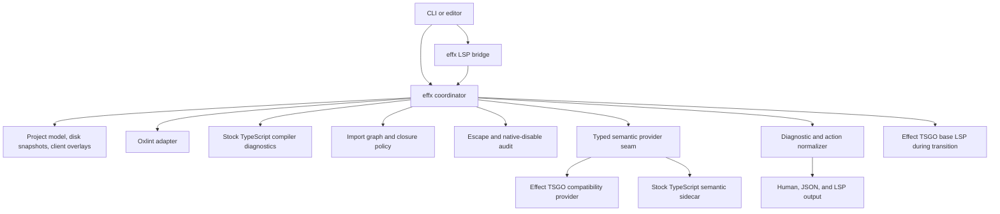

# `effx` coordinator and typed-provider architecture

Status: approved implementation authority after rigorous review

Date: 2026-08-11

Current implementation baseline: [`docs/current-status.md`](../docs/current-status.md)

Current typed-analysis boundary: [`docs/tsgo-boundary.md`](../docs/tsgo-boundary.md)

## Decision

`effx` will be the canonical command for the EffectTS enforcement layer.
It will ship from `@phibkro/oxlint-effect-plugin`.
The unpublished `effectts` command will be replaced without a compatibility alias.

`effx` will own one project lifecycle and one diagnostic model.
It will coordinate Oxlint, import closure, escape audits, TypeScript compiler diagnostics, generic typed lint rules, and Effect-specific typed diagnostics.

Typed Effect analysis will use a staged provider seam:

1. `@effect/tsgo` remains the compatibility provider for its current typed diagnostics and editor features.
2. A stock TypeScript 7 semantic sidecar implements rules proven through the public `typescript/unstable/*` surface.
3. Each rule moves only after oracle, identity, action, performance, and editor-behavior gates pass.
4. Stock TypeScript becomes the base language server only after all required editor capabilities pass the same gates.

The stock provider is the strategic direction.
It is not an immediate replacement for `@effect/tsgo`.
The unstable TypeScript API remains an explicit compatibility risk.

## Product boundary

TypeScript remains the host language.
EffectTS remains a stricter semantic profile inside TypeScript.

The repository does not create a parser, compiler, syntax, or source language.
It combines existing parsers and type checkers behind a stable EffectTS-facing contract.

The package remains independent of Effect Foundation, Semantic Systems, Workgraph, and Reef.
Biome is a product and workflow inspiration, not a dependency or affiliation.

## Command and public API cutover

| Command | Contract |
| --- | --- |
| `effx init` | Create a reviewed starter configuration and agent-guidance installation plan. |
| `effx setup` | Print a dependency, configuration, and editor plan. Make changes only with `--apply`. |
| `effx doctor` | Check versions, binary provenance, patch state, configuration, editor ownership, and provider compatibility. |
| `effx check [paths]` | Run the complete EffectTS gate and return one ordered diagnostic stream. |
| `effx lint [paths]` | Run Oxlint syntax, scope, and architecture rules with coordinator-owned import-closure and escape gates. |
| `effx fix [paths]` | Apply only machine-applicable fixes unless the user selects a guided action. |
| `effx explain <code-or-rule>` | Explain one invariant, its proof sources, replacements, and escape policy. |
| `effx translate` | Preserve the stdin Oxlint-JSON translation workflow under the new command name. |
| `effx suppressions [paths]` | Inventory reasoned escapes, file opt-outs, native disables, and stale entries. |
| `effx lsp start` | Start or connect to the project daemon through an editor-facing LSP bridge. |
| `effx lsp stop` | Stop the owned daemon and its child processes. |
| `effx lsp status` | Report custody, clients, snapshots, providers, pending work, and compatibility state. |
| `effx lsp suspend` | Pause expensive analysis without discarding project state. |
| `effx lsp resume` | Resume analysis and request diagnostic refreshes. |

`effx` does not own formatting.
Projects continue to use Oxfmt, dprint, or another formatter directly.
Effect code actions can still perform semantic source edits.

The pure library exports remain public.
The coordinator consumes `effect`, `translateOxlintJson`, `explainEffectTS`, `auditEffectTSEscapes`, `auditNativeDisableDirectives`, `evaluateImportClosure`, and `importClosurePolicy` rather than replacing them with process-only APIs.

The in-source escape tokens also remain stable:

- `oxlint-effect-plugin allow(<rule>):`
- `oxlint-effect-plugin ignore-file:`

Renaming the command does not rename directives in consumer source files.
The package `bin`, keywords, examples, and generated guidance move to `effx` in one unpublished cutover.

## System structure



The coordinator owns orchestration, not semantic reimplementation.
Each engine remains authoritative only for the evidence it can establish.

During the transition, `@effect/tsgo` is the sole base LSP backend.
This follows its supported deployment model and avoids two competing TypeScript-Go LSP servers.
The stock TypeScript provider is a semantic sidecar, not a second LSP.
It returns only diagnostics and actions for rules that passed the cutover gates.

## Analysis authority

| Concern | Initial authority | Long-term direction |
| --- | --- | --- |
| EffectTS syntax and lexical scope | Oxlint plugin | Same |
| Architectural role and platform policy | Oxlint plugin and project model | Same |
| Resolved import edges | `effx` resolver and pure policy gate | Same |
| Native and EffectTS escape auditing | `effx` audit pipeline | Same |
| Generic typed lint rules | Oxlint typed engine | Same unless measured evidence justifies replacement |
| TypeScript compiler diagnostics in CLI | Exact reviewed stock TypeScript | Same |
| TypeScript compiler diagnostics and standard editor features | Effect TSGO base LSP during transition | Exact reviewed stock TypeScript after full editor parity |
| Existing Effect typed diagnostics | Effect TSGO provider | Move rule-by-rule when stock sidecar parity passes |
| New typed EffectTS policy | Stock sidecar when its public API proves the invariant | Same |
| Effect editor actions, quick information, and refactors | Effect TSGO provider | Move only after behavior parity |

Oxlint JavaScript rules will not pretend to receive TypeScript types.
Oxc and TypeScript AST objects will not share identity.

## Project, client, and snapshot ownership

The daemon owns one project authority and one disk-backed project state.
Each editor connection owns an isolated unsaved-document overlay.
Effect TSGO cannot isolate two versions of one URI in one LSP session.
The daemon therefore starts one Effect TSGO base-LSP child for each editor overlay.
One client must never observe another client's unsaved text or diagnostics.
`effx check` always uses disk snapshots and exact stock TypeScript compiler diagnostics, including when an editor invokes it.
The live editor diagnostic stream uses that client's overlay and the Effect TSGO base LSP.

A source snapshot has these required fields:

```ts
interface SourceSnapshot {
  readonly uri: string
  readonly version: number
  readonly versionAuthority: "coordinator" | "client"
  readonly sha256: string
  readonly text: string
}
```

The coordinator assigns versions to disk snapshots.
An overlay copies the client's `textDocument.version` and marks its authority as `client`.
Disk and client version namespaces are never compared.
The coordinator assigns the hash for both snapshot kinds.
Provider adapters attach that identity to returned diagnostics and actions.
An adapter must fail a request when it cannot establish which bytes the engine analyzed.

For LSP pull results, the coordinator binds the request to the last client document version sent to that overlay's backend.
An unversioned response is valid only if no newer `didChange` was forwarded for that `(client, uri)`.
A superseded result is stale and must not reach the client.
Staleness is tracked for each client and provider contribution, not as one global last-writer check.

Coordinator records use normalized file URIs and UTF-16 code-unit ranges.
Each adapter converts engine offsets against the immutable snapshot text before normalization.
The Oxlint adapter converts Oxlint offsets.
The audit adapter treats fallback JavaScript string offsets as UTF-16 code units.
A host-supplied `ByteRange` requires adapter metadata that declares `byte` or `utf16`; missing metadata is an adapter failure.
The adapter converts declared byte ranges against the snapshot text and passes declared UTF-16 ranges through.
For native-disable findings, the coordinator derives the directive range from the immutable snapshot line and matched directive text.
The conversion must be tested with non-ASCII text before the LSP surface ships.
The portable `ByteRange` API remains a host-input type; it is not the editor output type.

CLI runs use a bounded one-shot lifecycle:

1. Load and validate configuration.
2. Discover governed files.
3. Create immutable source snapshots.
4. Run independent analysis adapters.
5. Normalize diagnostics and actions.
6. Apply escape policy and diagnostic authority.
7. Sort output deterministically.
8. Return the documented exit status.
9. Close every child process and provider.

The daemon keeps disk snapshots and provider projects warm.
It serializes writes to each mutable project or overlay.
Read-only requests for one source version can run concurrently.
A newer source version cancels superseded reads instead of waiting for them.
The LSP bridge maps `$/cancelRequest` to provider cancellation.

## Typed semantic provider

The internal interface is operation-based.
Method presence is the source of truth for provider capability.
A separate capability set cannot contradict the methods.

```ts
interface ProjectChangeSet {
  readonly changed: readonly SourceSnapshot[]
  readonly closed: readonly string[]
  readonly deleted: readonly string[]
}

interface TypedSemanticProvider {
  readonly id: string
  readonly engine: {
    readonly name: string
    readonly version: string
    readonly support: "stable" | "experimental" | "compatibility"
  }

  openProject(input: ProjectInput): Promise<ProjectHandle>
  update(handle: ProjectHandle, changes: ProjectChangeSet): Promise<void>
  reloadProject(handle: ProjectHandle): Promise<void>
  diagnostics?(
    handle: ProjectHandle,
    scope: AnalysisScope,
    signal: AbortSignal,
  ): Promise<readonly ProviderDiagnostic[]>
  codeActions?(
    handle: ProjectHandle,
    request: ActionRequest,
    signal: AbortSignal,
  ): Promise<readonly ProviderAction[]>
  quickInfo?(
    handle: ProjectHandle,
    request: QuickInfoRequest,
    signal: AbortSignal,
  ): Promise<ProviderQuickInfo | undefined>
  refactors?(
    handle: ProjectHandle,
    request: RefactorRequest,
    signal: AbortSignal,
  ): Promise<readonly ProviderRefactor[]>
  close(handle: ProjectHandle): Promise<void>
}
```

This is a semantic boundary, not a transport requirement.
A provider can use an in-process API, a child process, LSP, or another reviewed protocol.
The adapter owns transport-specific request IDs, source attribution, and cleanup.

### Effect TSGO compatibility provider

This provider preserves the existing Effect diagnostics and editor features.
During Stage B, it is the sole base LSP and carries ordinary TypeScript behavior as part of that supported superset.
The coordinator filters Effect syntax diagnostics already owned by the Oxlint plugin.
During Stage C, it also filters each Effect invariant that moves to the stock sidecar.

The provider must pin the reviewed `@effect/tsgo` release exactly during the `0.x` line.
Compatibility metadata must also record its embedded TypeScript revision.
A revision mismatch is status `2` unless the exact pair has a reviewed compatibility entry.
Oracle evidence produced under an unreviewed revision skew is invalid.

The package identity is `@effect/tsgo`.
Its TypeScript plugin identity is `@effect/language-service`.
`effx setup` plans the required plugin entry.
`effx doctor` verifies the entry and ensures no editor starts the provider outside `effx`.

### Stock TypeScript 7 provider

This provider uses the exact reviewed `typescript` package and its exported `unstable` APIs.
It cannot import unpublished TypeScript-Go internals.
It cannot patch the compiler during consumer installation.

`effx doctor` resolves and verifies all of these artifacts:

- the `typescript` package revision;
- the selected `@typescript/typescript-<platform>-<architecture>` package;
- the platform `tsc` binary hash; and
- the reviewed lockfile or registry integrity metadata.

A mismatch is a compatibility failure with status `2`.
Parity evidence is invalid unless this provenance check passes.
`effx doctor` also detects consumer-applied `effect-tsgo patch` changes to TypeScript, Oxlint, or `oxlint-tsgolint`.
A patched artifact cannot serve as the independent stock oracle.

The active TypeScript 7.0.2 binary was compared with a fresh uncached `--ignore-scripts` installation during this review.
Both SHA-256 values were `4f2de678286401759b3fb4475bafe35b8f32b4b3a07d92642bbf37eadc9b34a4`.
This is local environment evidence, not a substitute for shipped integrity metadata.

Each stock-provider rule must declare:

- the TypeScript API operations it needs;
- its Effect identity strategy;
- its proof kinds;
- an Effect TSGO or independently reviewed oracle;
- unsupported cases;
- measured query and snapshot costs; and
- the exact reviewed TypeScript revision.

A failed or missing API operation produces a provider failure.
It must not silently weaken a rule or fall back to member-name guessing.

## Diagnostic and action contract

The current `EffectTSDiagnostic` and `EffectTSJsonOutput` remain schema version 1.
Existing translation consumers keep that public contract.
The coordinator introduces a version 2 envelope rather than silently changing version 1.

```ts
type ProofKind =
  | "syntax"
  | "scope"
  | "module-graph"
  | "generic-ts-types"
  | "effect-types"
  | "convention"
  | "unenforceable"

interface Utf16Range {
  readonly start: number
  readonly end: number
}

interface EffxDiagnosticBase {
  readonly schemaVersion: 2
  readonly provider: string
  readonly source: {
    readonly uri: string
    readonly version: number
    readonly versionAuthority: "coordinator" | "client"
    readonly sha256: string
  }
  readonly range: Utf16Range
  readonly severity: "error" | "warning" | "message" | "suggestion"
  readonly message: string
  readonly explanation?: string
  readonly help?: string
  readonly docs?: string
  readonly proofKinds: readonly ProofKind[]
  readonly suggestions: readonly EffxSuggestion[]
  readonly origin: {
    readonly engine: string
    readonly code: string
  }
}

interface GovernedEffxDiagnostic extends EffxDiagnosticBase {
  readonly governed: true
  readonly code: EffectTSCode
  readonly subject: DiagnosticSubject
  readonly family: RuleFamily | "audit"
  readonly invariant: string
}

interface ExternalEffxDiagnostic extends EffxDiagnosticBase {
  readonly governed: false
  readonly code: string
  readonly subject: {
    readonly kind: "external"
    readonly system: "typescript" | "provider"
  }
  readonly family: "external"
  readonly invariant?: never
}

type EffxDiagnostic = GovernedEffxDiagnostic | ExternalEffxDiagnostic

interface EffxJsonOutput {
  readonly schemaVersion: 2
  readonly status: 0 | 1 | 2
  readonly diagnostics: readonly EffxDiagnostic[]
}
```

Proof kind describes the evidence.
Provider and origin describe the engine.
Moving one rule between providers must not change its proof kind.
The version 2 migration replaces the version 1 provider-named `typed-oxlint` and `tsgo` values with `generic-ts-types` and `effect-types`.
The array is ordered and nonempty for an enforced finding.
Conventions and currently unenforceable invariants remain visible in explanations and gap reports.

`EffxSuggestion` preserves the four shipped applicability classes:

- `machine-applicable`: safe without user intent;
- `choice-required`: several valid outcomes exist;
- `refactor-required`: caller or architecture contracts must change; and
- `boundary-required`: the repair belongs at an external boundary or adapter.

Only a machine-applicable suggestion can contain automatic text edits.
`effx fix` applies only that class by default.
A guided mode can present choice-required actions.
It never converts a choice into an automatic edit.

Provider and external actions default to `choice-required`.
Only an exact reviewed registry entry can raise one provider action to `machine-applicable`.
The presence of text edits does not raise applicability by itself.

Every machine-applicable LSP edit uses `documentChanges` with the client-owned snapshot version.
If the current client version differs when the user selects the action, `effx` recomputes or refuses the edit.
Disk snapshot versions never appear in an editor `TextDocumentEdit`.
The coordinator does not apply stale ranges.

## Diagnostic authority, unmapped output, and duplicate control

The rule registry assigns one authority to each governed invariant.
Providers do not compete by message text or range.

The coordinator applies this order:

1. Reject stale provider contributions.
2. Map provider diagnostics to canonical invariant identifiers.
3. Retain unmapped provider output as `ExternalEffxDiagnostic` with origin metadata.
4. Classify provider actions. Default to `choice-required`; raise only through reviewed registry metadata.
5. Apply project rule and severity configuration to governed output.
6. Keep the configured authority for each governed invariant and source site.
7. Apply reasoned EffectTS escapes only to mapped governed rules.
8. Derive ranges for native-disable findings and audit them separately.
9. Sort by URI, start offset, severity rank, code, and provider.

Unmapped output is never dropped silently.
Its provider severity determines whether it fails the gate.
A project can lower or disable an unmapped provider code only through explicit provider-diagnostic configuration.
An unmapped diagnostic cannot use a reasoned rule escape because it has no canonical rule identity.

In CLI runs, stock TypeScript alone owns ordinary compiler diagnostics.
Before normalization, the Effect TSGO adapter removes its ordinary TypeScript output by reviewed engine-code classification, never by message or range.
It retains mapped and unmapped Effect-owned output and records the authority-filter counts.
This filter does not apply when Effect TSGO is the live editor's base LSP.

Matching ranges alone do not make diagnostics duplicates.
Different proof kinds can report distinct concerns at one source site.

Project configuration uses `error`, `warn`, and `off`.
The normalizer maps `warn` to output severity `warning`.
`off` removes the configured governed rule before analysis output.
Only `error` and `warning` diagnostics produce status `1`.
`message` and `suggestion` output never fail the gate by themselves.

## LSP bridge and semantic sidecar

`effx lsp` is the only language-server process that an editor starts for a configured project.
The editor must not also start `@effect/tsgo` or another TypeScript server for that project.

During Stage B, each editor bridge forwards base language-service requests to its own Effect TSGO LSP child.
The coordinator intercepts diagnostics and actions for normalization, authority filtering, and source attribution.
It passes through standard completions, hover, navigation, rename, and refactors until a reviewed `effx` operation replaces them.
For a base-provider action, it preserves opaque provider data and routes `codeAction/resolve` to the owning child before applicability and version checks.

During Stage C, the stock TypeScript sidecar receives the same immutable snapshots through its API adapter.
It returns only the typed Effect rules assigned to it.
It does not receive client JSON-RPC IDs, dynamic registrations, or general language-service requests.
This topology avoids two LSP request-ID spaces and two competing capability sets.

The coordinator keeps the current diagnostic contribution for each `(client, uri, provider)`.
For push diagnostics, an empty provider set clears only that provider's contribution.
The bridge publishes one sorted union for the URI and source version.
For pull diagnostics, the bridge owns the `resultId`.
It caches every provider's last full set, expands backend `unchanged` reports from that cache, and returns `unchanged` only when every contribution is unchanged.

The bridge amends the client-facing `initialize` result for `effx` capabilities.
It extends, rather than replaces, the base `executeCommandProvider.commands` list with the exact registered `effx.*` commands.
The coordinator handles `effx.*` commands.
It forwards non-`effx.*` commands to the base LSP that advertised them.
It also advertises an `effx` diagnostic identifier with workspace diagnostics.
This delivers import-closure and escape findings for closed files.
A workspace report omits URIs that the requesting client has open; document pull serves those URIs from that client's overlay.
For each closed-file report, the LSP document version is `null`.
A coordinator-owned disk version never appears as a client document version.

Choice-required actions carry an `effx.*` command or selection payload, not an automatic edit.
Machine-applicable actions can carry only versioned `WorkspaceEdit` data.

While suspended, the bridge still handles document synchronization, status, shutdown, and exit.
It answers analysis requests immediately with `ContentModified` or a documented empty report.
It does not leave requests pending.
Resume requests diagnostic and workspace refreshes.

The bridge sends parameterless LSP requests without a `params` member.
Normal shutdown requires a successful `shutdown` response before `exit`.
After a bounded timeout, cleanup uses the platform process-termination adapter and then forces termination.
A child exit after successful shutdown is expected teardown.
An unexpected child exit or failed shutdown is a provider failure and cannot produce a clean check result.

`effx lsp status` reports the daemon, each client overlay, child, source version, pending request count, cancellation count, and last failure.

## Configuration

The existing EffectTS project declaration remains authoritative for semantic policy:

- strictness;
- role;
- platform;
- semantic boundary;
- trusted-pure dependencies;
- runtime-adapter dependencies;
- named rule overrides; and
- severity overrides.

Provider selection is operational configuration.
It does not define a new EffectTS dialect and cannot silently lower rules.

A future surface can select `auto`, `effect-tsgo`, or `stock-ts7` for one typed rule.
`auto` uses the registry's reviewed authority.
Explicit selection fails when the provider lacks the required operation or reviewed compatibility entry.

## Setup, custody, and cleanup

`effx setup` prints a plan before it changes dependencies, `tsconfig.json`, editor settings, or project files.
`effx setup --apply` performs only the displayed plan.
Noninteractive use requires an explicit approval flag.
Publishing, registry changes, and external provider changes require operator authority.

The daemon uses an atomically created project ownership record.
The record contains the process ID, endpoint, start identity, and project root.
A connecting process verifies liveness and start identity before it trusts the record.
A dead or mismatched owner permits atomic stale-record takeover.
A live owner receives new connections through the recorded endpoint.

Each editor starts a small stdio bridge.
The bridge connects to the owner and creates one client overlay.
The daemon exits after the last client disconnects unless explicit configuration requests persistence.
Provider children run in an owned process group or platform job object when available.
Normal daemon exit terminates every owned child.
After abnormal owner death, stale-record recovery verifies and reaps surviving owned children before takeover.
`effx doctor` reports stale records and orphan-risk state with a recovery command.

## Exit statuses

| Status | Meaning |
| --- | --- |
| `0` | The operation completed without remaining error or warning diagnostics. |
| `1` | Governed or external error or warning diagnostics remain. |
| `2` | Arguments, configuration, compatibility, provider, transport, or internal execution failed. |

`EffxJsonOutput.status` carries the same status category in machine-readable output.
Provider failure is never reported as a clean project.

## Reviewed evidence and its limits

### Exploratory evidence

The discarded probes under `.tmp/ts7-adapter-tracer` are not acceptance evidence.
They established that the TypeScript 7 API and LSP surfaces were worth a tracked experiment.
They did not establish a product topology or an editor parity claim.

### Tracked Stage 0 tracer

Stage 0 is now a tracked, executable tracer.
The source and fixtures are:

- `scripts/tracers/0001-effx-provider-seam.ts`
- `scripts/tracers/0001-effx-semantic-identity.ts`
- `scripts/tracers/0001-effx-channel-relations.ts`
- `scripts/tracers/fixtures/0001-effx-provider-seam/`
- `scripts/tracers/fixtures/0001-effx-provider-seam-project-b/`
- `scripts/tracers/fixtures/0001-effx-semantic/`

Run `bun run accept:effx:0001`.
Use `bun run scripts/accept-effx-0001.ts write` only to record a reviewed evidence update.

| Area | Observed result |
| --- | --- |
| Provider seam | One client-facing proxy started the pinned `@effect/tsgo` 0.36.4 LSP and the pinned TypeScript 7.0.2 executable. The stock LSP was hidden behind the tracer's diagnostic-sidecar interface. |
| Diagnostic ownership | The merged result retained Effect code 377001 from `@effect/tsgo` and generic TS2322 from stock TypeScript. The merge removed the duplicate generic diagnostic from the Effect provider. |
| Push and pull | Provider push publications and client pull diagnostics used per-provider caches. The proxy returned a client-facing `unchanged` report without losing the prior merged set. |
| Cancellation | A live diagnostic request received `$/cancelRequest` in both providers. One provider returned `RequestCancelled` (`-32800`), and the proxy returned its last complete merged publication. This fallback is reported as an observed unsupported operation. |
| Edits and projects | The tracer exercised cold, warm, incremental, Effect-heavy, second-project, empty, closed-file, and shutdown paths. |
| Commands | Initialize advertised `effx.chooseEffectComposition` and `effx.status`. Standard `workspace/executeCommand` routing accepted the current source hash and rejected a stale hash with `-32001`. |
| Repair safety | The choice-required action had no `WorkspaceEdit`. Its payload carried the source SHA-256 and three explicit composition choices. |
| Effect identity | The stock TypeScript 7 unstable API accepted direct, renamed, namespace-qualified, aliased, wrapped, function-returned, and interface-subtype Effect values through canonical declaration provenance. |
| Negative identity | It rejected a shadowed name and a local lookalike. It reported unresolved alias and opaque-wrapper provenance as unsupported instead of treating them as Effect values. |
| Channel relation | The stock checker reproduced the three generic channel relations for `missingEffectContext`. It derived span `278..284`, which matched an independent current `@effect/tsgo` diagnostic. |
| Experimental API failure | An injected `Checker.getTypeAtLocation` failure produced structured failed-operation and unsupported-identity evidence. The tracer did not crash or silently accept the value. |
| Provider failure | Missing, mis-versioned, and non-executable providers failed before work. An injected failure after process startup still terminated both child processes. |
| Provenance | Evidence records the package versions, executable SHA-256 values, fixture SHA-256 value, diagnostic sources, ranges, protocol directions, timings, and coordinator RSS. |

The retained outputs are:

- `docs/acceptance/effx-0001-observed-red.txt`
- `docs/acceptance/effx-0001-observed-green.txt`
- `docs/acceptance/effx-0001-observed-performance.json`

The performance artifact is a local baseline, not a benchmark claim.
Acceptance requires matching provider and fixture provenance.
It also checks that current measurements are positive and below a broad regression bound.

The provider-seam tracer uses a real stock TypeScript LSP as a diagnostic-sidecar prototype.
It proves client-facing coordination behavior, but it is not the final Stage C topology.
Stage B and Stage C must use one base LSP and the TypeScript unstable semantic API.
They must not ship a second stock LSP process.

## Frozen tracer contract before product implementation

The tracked tracer freezes the Stage 0 contract before Stage A changes product code.
It must continue to establish these facts:

1. A discarded Effect expression fails; a composed Effect and a non-Effect expression pass.
2. Direct imports, renamed imports, namespace-qualified types, type aliases, interface subtypes, and function-returned Effects prove identity.
3. Local lookalikes, shadowed names, unresolved aliases, and opaque wrapper provenance do not match.
4. Error and context channel relations match an independent Effect TSGO oracle.
5. The stock implementation derives both diagnostic span endpoints without reading oracle ranges.
6. A real Effect TSGO base LSP and a stock diagnostic sidecar share one source snapshot without duplicate TypeScript diagnostics.
7. Push and pull diagnostics preserve TypeScript and Effect sets across edits, empty sets, `unchanged` reports, and cancellation. Pulls for closed files are rejected.
8. `effx.*` commands are advertised, routed through standard LSP, executed, and rejected when the source snapshot is stale or unavailable.
9. Shutdown succeeds before exit; forced cleanup leaves no child process.
10. Cold, warm, incremental, Effect-heavy, and multi-project runs record time and coordinator RSS.
11. Every run records exact package revisions, executable hashes, fixture hashes, and stable evidence.
12. Unsupported identity and provider behavior remains explicit and machine-readable.

A temporary probe or prose claim cannot satisfy this gate.

## Rule cutover gates

A typed rule can move from Effect TSGO to stock TypeScript only when all gates pass:

1. The invariant and provider-independent proof kinds are explicit.
2. Stock binary provenance matches the reviewed artifact.
3. At least one oracle fixture fails before the stock implementation exists.
4. Valid aliases, wrappers, and subtype cases pass.
5. Lookalikes and shadowed imports do not match.
6. Diagnostic code, independently derived range, channel facts, and severity match the reviewed oracle.
7. Provider and origin identity are correct.
8. Every action has the correct applicability class.
9. Machine edits are versioned, idempotent, and formatter-safe.
10. Incremental editor latency and memory stay within recorded limits.
11. Provider failure cannot produce a clean result.
12. CLI, JSON, and LSP sets are equivalent for invariants owned by the rule registry.
13. Quick information, refactors, completions, and rename behavior pass separate gates before their ownership moves.

The project removes the compatibility provider only after every required diagnostic and editor capability passes.
Until then, mixed semantic providers are intentional and visible, but only one provider is the base LSP.

## Delivery stages

### Stage 0: preserved tracer

Completed. The tracked tracer, fixtures, strict TypeScript check, red evidence, green evidence, and performance baseline are repository artifacts.
`bun run accept:effx:0001` re-executes the provider, semantic, failure, cleanup, and oracle paths.

### Stage A: coordinator contract

Implement the project model, source identities, version 2 diagnostic envelope, authority rules, provider operations, and `effx check` orchestration.
Use current tools through adapters.
Keep the version 1 library schema available.

### Stage B: editor lifecycle

Implement `effx lsp` with Effect TSGO as the sole base LSP.
Add diagnostic interception, client overlays, command routing, status, suspend, resume, cancellation, and deterministic cleanup.
Do not run stock TypeScript as a second LSP.

### Stage C: stock typed rules

Add stock TypeScript through the semantic sidecar API.
Port typed invariants one at a time.
The floating-Effect and missing-context tracer slices now satisfy their Stage 0 evidence gates.
Port rules only after Stage A and Stage B establish the product contracts, and keep oracle fixtures and performance evidence for every port.

### Stage D: base LSP cutover and compatibility retirement

Move standard language-service ownership to stock TypeScript only after full editor parity.
Remove `@effect/tsgo` only after every required diagnostic and editor capability passes.
Do not maintain a permanent compiler fork to accelerate this stage.

## Rejected alternatives

### Immediate stock TypeScript rewrite

Rejected because the exploratory probes do not establish parity for the complete Effect language-service surface.
The TypeScript API is also explicitly unstable.

### Dual stock and Effect TSGO LSP backends

Rejected for the product transition.
The Stage 0 tracer used a contained dual-process prototype to expose collision, merge, cancellation, and cleanup behavior.
That evidence does not authorize the product to run two base language servers.
The product keeps Effect TSGO as its sole base LSP and introduces stock TypeScript through the semantic API sidecar.

### Effect TSGO as the permanent coordinator

Rejected because a compiler fork must not own project policy, import closure, escapes, reporting, or Oxlint execution.
Its temporary role as the sole base LSP does not give it that authority.

### Typed facts injected into Oxlint JavaScript rules

Rejected because the current Oxlint plugin contract has no supported checker or typed-fact seam.
Source-position translation would add coupling without improving rule authority.

### Oxc-owned Effect type checker

Rejected because Oxc does not provide the required TypeScript type graph through this plugin surface.
Rebuilding that graph would duplicate TypeScript and Effect language-service work.

### Maintained Effect TSGO fork

Rejected unless an upstream-required capability is blocked and no adapter can supply it.
No current evidence justifies another compiler fork.

## Known unresolved work

- Full parity for every required Effect TSGO diagnostic is unproven.
- Effect completion, refactor, quick-information, rename, and action parity is unproven.
- The Stage 0 dual-process prototype is not the required single-base-LSP product topology.
- Sustained monorepo, multi-client, and regression-budget performance remains unmeasured.
- Unresolved aliases and opaque wrapper provenance remain explicit unsupported identity cases.
- Cancellation currently relies on the last complete merged publication when one provider cancels a pull.
- A future TypeScript API revision can change or remove the unstable provider contract.
- The reviewed `@effect/tsgo` pin trails upstream, which now also patches Oxlint and TypeScript surfaces.
- The provider re-review cadence and policy for consumer-applied patches are undecided.
- Arbitrary typed `.then`, `.catch`, and `.finally` domain ownership remains unimplemented.
- Migration baselines remain a separate product decision.

These gaps are gates, not silent assumptions.
