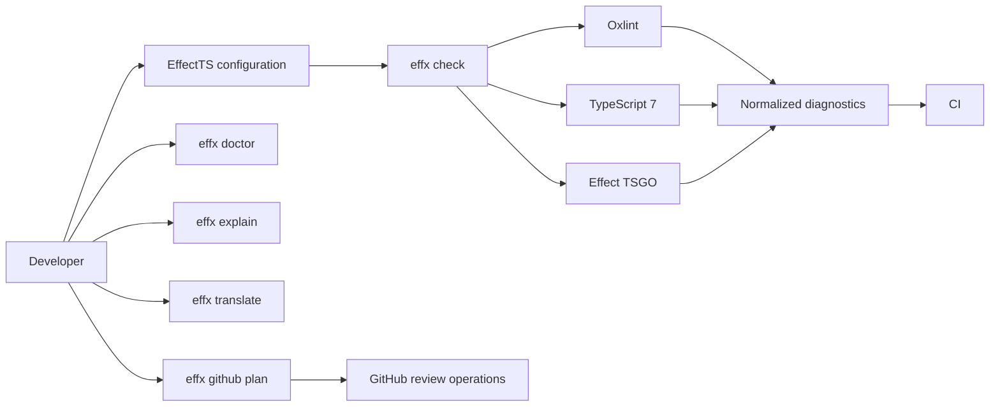

# Current adoption status

Status date: 2026-08-11

## Product position

The repository currently ships an EffectTS enforcement SDK and Oxlint JavaScript
plugin. It is not yet a complete end-user enforcement application.

The product direction has now expanded: it will become an independent Effect language
tool that uses Oxlint for TypeScript syntax and scope diagnostics and integrates
Effect's language tooling for typed diagnostics. It remains a community-made tool and
must not imply Effect Foundation ownership.

Biome is an explicit primary inspiration for the future tool. The goal is to adopt
Biome's clear product organization, unified project workflow, structured diagnostics,
and conservative code-action model for the Effect programming model. This is
inspiration and attribution, not affiliation.

The package has not been published. Registry installation examples describe the
intended consumer journey after publication. Current adopters need a packed tarball or
a workspace dependency.

## Current user journey



`effx check` is the shipped bounded one-shot coordinator for the CLI gate. It loads
the project, discovers governed files, runs Oxlint, TypeScript, and Effect TSGO,
applies escape and diagnostic policy, sorts one diagnostic stream, and exits.

`effx doctor` is a separate bounded environment check. It validates the project,
required configuration files, reviewed provider versions, and provider executables.

`effx github plan` is a pure review-plan command. It converts decoded diagnostics
and changed-line ranges into check annotations and create, update, or resolve
operations. It rejects a missing or mismatched immutable head SHA before planning.

The package still does not start a daemon or provide an LSP command. Those remain
future work.

### Evaluate

The developer reads `README.md`, `compatibility.json`, the rule catalog, and
`docs/tsgo-boundary.md`. They decide whether the exact reviewed Effect and Oxlint
versions, the architectural role model, and the split typed-analysis pipeline fit
the project.

`effx doctor` provides bounded project and provider inspection. It does not compare
two compatibility tables or produce a migration report.

### Install and configure

The intended installation is:

```sh
bun add -d @phibkro/oxlint-effect-plugin oxlint
```

A developer can configure one rule directly in `.oxlintrc.json`, or use the typed
`effect(...)` builder from `oxlint.config.ts`. The typed builder is the intended
project-level path. It declares:

- file groups;
- architectural role;
- runtime platform;
- semantic boundaries;
- strictness;
- project and group rule overrides;
- trusted-pure dependencies; and
- runtime-adapter dependencies.

Strict enforcement is the default. `strictness: "recommended"` is an explicit
lowering. Invalid roles, platforms, boundaries, rules, severities, dependencies, and
empty groups fail configuration expansion.

There is no interactive initializer.

### Develop and diagnose

The developer runs the shipped coordinator:

```sh
effx check
effx check --format json
```

The check discovers TypeScript source files, runs Oxlint, TypeScript 7.0.2, and
Effect TSGO 0.36.4, then combines governed and external diagnostics in one ordered
stream. A clean check returns exit status `0`. A check with diagnostics returns `1`.
Invalid configuration, missing providers, provider version mismatch, malformed
provider output, or another operational failure returns `2`.

The strict profile reports eight default EffectTS syntax and scope rules. A ninth
package-barrel rule is available only when the project configures package roots and
enables it.

The lower-level translation workflow remains available:

```sh
oxlint --format json | effx translate --plugin effect
```

For an explanation:

```sh
effx explain EFT3101
effx explain no-native-promise-control-flow
```

The translator adds stable EFT codes, semantic families, invariants, proof sources,
help, documentation references, and repair applicability. The CLI now contains
`check`, `doctor`, `explain`, `translate`, and `github plan`.

`effx doctor` accepts `--format human` or `--format json`. It returns exit status `0`
when project, configuration, and reviewed providers are healthy. It returns `2` for
project loading, configuration, or provider inspection failure. Its output names
these checks as `unverified`, because they are not implemented:

- `binary-hash`;
- `registry-integrity`;
- `patch-detection`;
- `editor-ownership`;
- `daemon-custody`; and
- `platform-artifact-provenance`.

These unverified checks do not make a healthy doctor run fail. Doctor does not prove
binary hashes, registry integrity, provider patch state, editor ownership, daemon
custody, or platform artifact provenance.

`effx github plan` reads one decoded JSON input from standard input:

```sh
effx github plan < decoded-input.json
```

It returns exit status `0` for an accepted plan and `1` for a rejected plan or
planning error. It fingerprints findings, limits inline comments, keeps outside-
diff findings in the check summary, updates existing fingerprints, resolves stale
comments, and rejects duplicate existing fingerprints. It plans operations only; a
runtime GitHub adapter must publish them.

### Repair

Only one narrow case has a machine-applicable fix. Inside a recognized `Effect.gen`
generator, a direct `console.log(...)` expression can become
`yield* Console.log(...)` with a collision-safe import edit.

The repair does not apply to aliases, computed properties, other console methods,
shadowed bindings, calls outside recognized generators, static blocks, or cases with
no safe import plan. Other violations require guided or architectural repair.

The current fixer establishes syntactic safety, not developer intent. In particular,
a development-only console statement may need deletion or a reasoned exception rather
than conversion into Effect observability.

There is no package-specific fix command or interactive code-action selector.

### Use a reasoned escape

A local exception names one exact rule and supplies an immediate nonempty reason:

```ts
// oxlint-effect-plugin allow(no-ambient-console):
// reason: vendor payload inspection at the adapter boundary
console.dir(payload);
```

A valid exception applies to the next syntax node in the same lexical block. Invalid,
broad, duplicate, misplaced, missing-reason, unused, and stale exceptions fail the
audit.

A top-level file opt-out also requires a reason and must appear before executable code.
Late, malformed, duplicate, or missing-reason file opt-outs fail.

The package exports `auditEffectTSEscapes`, but the shipped `effx check` coordinator
supplies source discovery, AST-derived syntax and block ranges, normalized
diagnostics, and final aggregation. Hosts that call the pure audit directly remain
responsible for those inputs. Without syntax targets, local exceptions are reported
as misplaced.

Native Oxlint and ESLint disable directives require the independent
`auditNativeDisableDirectives` pass because native disables run before plugin rules.
The shipped check runs this audit. The package still has no separate suppression-audit
command.

### Govern imports

`importClosurePolicy(...)` projects the same configuration into import-policy context.
The shipped check resolves and classifies import edges before calling
`evaluateImportClosure(...)`.

The gate admits type-only imports, core Effect imports, permitted governed-project
edges, exact reasoned trusted-pure value imports, and raw dependencies declared by the
owning runtime adapter. Other edges produce EFT5101.

The pure import policy does not discover files or resolve modules. The shipped check
provides that integration; there is no separate import-closure command.

### Run typed diagnostics

The shipped check runs the analysis layers in one bounded process:

1. This package owns EffectTS syntax and scope policy through Oxlint.
2. TypeScript 7.0.2 owns generic compiler diagnostics.
3. `@effect/tsgo` 0.36.4 owns Effect-specific typed diagnostics and quick fixes.

Enabling Oxlint type-aware mode does not provide TypeScript types to JavaScript plugin
rules. The coordinator combines provider output, but arbitrary typed `.then`, `.catch`,
and `.finally` ownership remains an explicit analysis gap.

### Enforce in CI

`effx check` composes:

1. configuration validation and expansion;
2. source discovery and immutable snapshots;
3. native-disable auditing;
4. Oxlint execution;
5. reasoned-escape matching and inventory;
6. import graph resolution and closure evaluation;
7. generic TypeScript diagnostics;
8. Effect TSGO diagnostics;
9. deterministic reporting; and
10. exit status.

Its exit status is `0` for no diagnostics, `1` for diagnostics, and `2` for an
operational failure. The check is a bounded one-shot command and closes its
providers before it exits.

### Migrate and upgrade

Existing projects can lower selected groups to `recommended`, override named rules, or
use explicit escapes. There is no migration baseline that admits existing violations
while rejecting new ones.

Compatibility metadata records exact reviewed versions. `effx doctor` checks the
current project and providers, but there is no compatibility comparison, migration
report, or automated upgrade procedure.

### Guide coding agents

The package ships an AGENTS fragment, a portable skill, prompts, rule documents, and
machine-readable knowledge. A consumer must install these assets into its agent
workflow manually.

## Maturity by surface

| Surface                             | Current maturity                                                   |
| ----------------------------------- | ------------------------------------------------------------------ |
| Compiled package and Oxlint loading | Strong                                                             |
| Typed configuration and validation  | Strong                                                             |
| Strictness and applicability model  | Strong                                                             |
| Rule diagnostics and explanations   | Strong                                                             |
| Automatic repair                    | Sound but narrow                                                   |
| Reasoned escape semantics           | Strong                                                             |
| Escape integration                  | Shipped in `effx check`                                            |
| Import-closure semantics            | Strong                                                             |
| Import graph integration            | Shipped in `effx check`                                            |
| Typed-analysis ownership            | Clear                                                              |
| Typed-analysis execution            | Shipped in `effx check`                                            |
| Typed-provider coordinator tracer   | Stage 0 accepted; not shipped                                      |
| Consumer CI                         | Check command shipped; workflow integration remains consumer-owned |
| Existing-project migration          | Limited                                                            |
| Upgrade journey                     | Metadata plus bounded doctor                                       |
| Agent guidance                      | Shipped, manually installed                                        |

## Primary ergonomic gap

`effx check`, `effx doctor`, and `effx github plan` now provide bounded CLI
surfaces. Adoption still requires project configuration and consumer-owned CI or
GitHub runtime adapters.

The next approved direction is the broader
[`effx`](../design-specs/0004-effx-coordinator.md) lifecycle: initialization,
setup, fix, suppression inventory, and daemon-backed LSP commands. Those surfaces
remain future work.

The repository retains an executable Stage 0 coordinator tracer and acceptance
evidence. It merges one real Effect diagnostic with one stock TypeScript diagnostic,
tests editor lifecycle and failure paths, and reproduces two stock semantic proofs.
This changes implementation confidence only. It does not add a daemon, LSP package,
or those future lifecycle commands.
