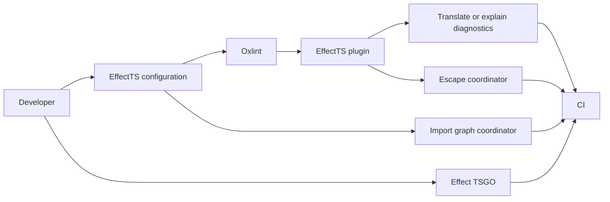

# Current adoption status

Status date: 2026-08-11

## Product position

The repository currently ships an EffectTS enforcement SDK and Oxlint JavaScript
plugin. It is not yet a complete end-user enforcement application.

The product direction has now expanded: it will become an independent Effect language
tool that uses Oxlint for TypeScript syntax and scope diagnostics and integrates
Effect's language tooling for typed diagnostics. It remains a community-made tool and
must not imply Effect Foundation ownership.

Biome is an explicit primary inspiration for the future tool. The goal is to adopt
Biome's clear product organization, unified project workflow, structured diagnostics,
and conservative code-action model for the Effect programming model. This is
inspiration and attribution, not affiliation.

The package has not been published. Registry installation examples describe the
intended consumer journey after publication. Current adopters need a packed tarball or
a workspace dependency.

## Current user journey



### Evaluate

The developer reads `README.md`, `compatibility.json`, the rule catalog, and
`docs/tsgo-boundary.md`. They decide whether the exact reviewed Effect and Oxlint
versions, the architectural role model, and the split typed-analysis pipeline fit the
project.

There is no compatibility or environment inspection command.

### Install and configure

The intended installation is:

```sh
bun add -d @phibkro/oxlint-effect-plugin oxlint
```

A developer can configure one rule directly in `.oxlintrc.json`, or use the typed
`effect(...)` builder from `oxlint.config.ts`. The typed builder is the intended
project-level path. It declares:

- file groups;
- architectural role;
- runtime platform;
- semantic boundaries;
- strictness;
- project and group rule overrides;
- trusted-pure dependencies; and
- runtime-adapter dependencies.

Strict enforcement is the default. `strictness: "recommended"` is an explicit
lowering. Invalid roles, platforms, boundaries, rules, severities, dependencies, and
empty groups fail configuration expansion.

There is no interactive initializer.

### Develop and diagnose

The developer runs Oxlint. The strict profile reports eight default EffectTS syntax and scope rules. A ninth package-barrel rule is available only when the project configures package roots and enables it.
For structured output:

```sh
oxlint --format json | effectts translate --plugin effect
```

For an explanation:

```sh
effectts explain EFT3101
effectts explain no-native-promise-control-flow
```

The translator adds stable EFT codes, semantic families, invariants, proof sources,
help, documentation references, and repair applicability. The CLI currently contains
only `explain` and `translate`.

### Repair

Only one narrow case has a machine-applicable fix. Inside a recognized `Effect.gen`
generator, a direct `console.log(...)` expression can become
`yield* Console.log(...)` with a collision-safe import edit.

The repair does not apply to aliases, computed properties, other console methods,
shadowed bindings, calls outside recognized generators, static blocks, or cases with
no safe import plan. Other violations require guided or architectural repair.

The current fixer establishes syntactic safety, not developer intent. In particular,
a development-only console statement may need deletion or a reasoned exception rather
than conversion into Effect observability.

There is no package-specific fix command or interactive code-action selector.

### Use a reasoned escape

A local exception names one exact rule and supplies an immediate nonempty reason:

```ts
// oxlint-effect-plugin allow(no-ambient-console):
// reason: vendor payload inspection at the adapter boundary
console.dir(payload)
```

A valid exception applies to the next syntax node in the same lexical block. Invalid,
broad, duplicate, misplaced, missing-reason, unused, and stale exceptions fail the
audit.

A top-level file opt-out also requires a reason and must appear before executable code.
Late, malformed, duplicate, or missing-reason file opt-outs fail.

The package exports `auditEffectTSEscapes`, but a host must supply source discovery,
AST-derived syntax and block ranges, normalized diagnostics, and final aggregation.
Without syntax targets, local exceptions are reported as misplaced.

Native Oxlint and ESLint disable directives require an independent
`auditNativeDisableDirectives` pass because native disables run before plugin rules.
The package does not provide file discovery or a command for this audit.

### Govern imports

`importClosurePolicy(...)` projects the same configuration into import-policy context.
A coordinator resolves and classifies import edges before calling
`evaluateImportClosure(...)`.

The gate admits type-only imports, core Effect imports, permitted governed-project
edges, exact reasoned trusted-pure value imports, and raw dependencies declared by the
owning runtime adapter. Other edges produce EFT5101.

The package does not discover files, resolve modules, classify targets, or provide an
import-closure command.

### Run typed diagnostics

The analysis layers are separate:

1. This package owns EffectTS syntax and scope policy through Oxlint.
2. Oxlint's typed engine owns generic TypeScript typed rules.
3. `@effect/tsgo` owns Effect-specific typed diagnostics and quick fixes.

Enabling Oxlint type-aware mode does not provide TypeScript types to JavaScript plugin
rules. Consumers must run and combine the typed tools separately. Arbitrary typed
`.then`, `.catch`, and `.finally` ownership remains an explicit analysis gap.

### Enforce in CI

A complete consumer gate must currently compose:

1. configuration validation and expansion;
2. native-disable auditing;
3. Oxlint execution;
4. reasoned-escape matching and inventory;
5. import graph resolution and closure evaluation;
6. generic typed Oxlint diagnostics;
7. Effect TSGO diagnostics; and
8. deterministic reporting and exit status.

The repository's `bun run check` proves these layers independently. It is a maintainer
gate, not a consumer-facing orchestration command.

### Migrate and upgrade

Existing projects can lower selected groups to `recommended`, override named rules, or
use explicit escapes. There is no migration baseline that admits existing violations
while rejecting new ones.

Compatibility metadata records exact reviewed versions. There is no doctor,
compatibility comparison, migration report, or automated upgrade procedure.

### Guide coding agents

The package ships an AGENTS fragment, a portable skill, prompts, rule documents, and
machine-readable knowledge. A consumer must install these assets into its agent
workflow manually.

## Maturity by surface

| Surface | Current maturity |
| --- | --- |
| Compiled package and Oxlint loading | Strong |
| Typed configuration and validation | Strong |
| Strictness and applicability model | Strong |
| Rule diagnostics and explanations | Strong |
| Automatic repair | Sound but narrow |
| Reasoned escape semantics | Strong |
| Escape integration | Coordinator required |
| Import-closure semantics | Strong |
| Import graph integration | Coordinator missing |
| Typed-analysis ownership | Clear |
| Typed-analysis execution | Separate external workflow |
| Typed-provider coordinator tracer | Stage 0 accepted; not shipped |
| Consumer CI | Not packaged |
| Existing-project migration | Limited |
| Upgrade journey | Metadata only |
| Agent guidance | Shipped, manually installed |

## Primary ergonomic gap

Adoption currently means assembling an enforcement toolchain. The highest-leverage
next step is a consumer-facing command that owns configuration loading, file discovery,
Oxlint execution, diagnostic translation, escape auditing, import closure, Effect TSGO
integration, reporting, and exit status.

The approved direction for that command is
[`effx`](../design-specs/0004-effx-coordinator.md). The design keeps this file
as the current-state baseline and does not present planned coordinator work as shipped.

The repository now retains an executable Stage 0 coordinator tracer and acceptance
evidence. It merges one real Effect diagnostic with one stock TypeScript diagnostic,
tests editor lifecycle and failure paths, and reproduces two stock semantic proofs.
This changes implementation confidence only. It does not add an `effx` command,
daemon, LSP package, or consumer workflow.
